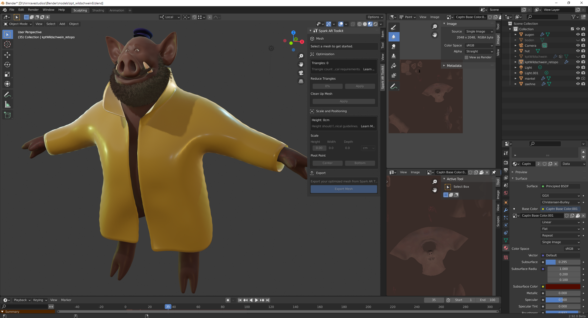

# CV and Resume of Johannes Rave

### [Formal documents and contact information](./documents)

- Curriculum Vitae _[en]() \| [de]()_
- Academic achievements _[en]() \| [de]()_
- [Email me!](mailto:johannes.rave@gmail.com)

### Applications, scripting and automation

- [Integrating a physics engine into AR-filters]()  
  Using TypeScript and cannon.js in [SparkAR](https://sparkar.facebook.com/ar-studio/).
- [Implementing billboarding on a tracked plane]() into [SparkAR](https://sparkar.facebook.com/ar-studio/)-filters  
  Using JavaScript and maths.
- [Generative design for a front grille](https://github.com/johannesrave/curriculum_vitae/tree/main/parametric_grille) using [Grasshopper](https://www.grasshopper3d.com/) and C#, inspired by my own work in the car industry (repo)
- [A shutline generator]() in [Dynamo for Alias](https://knowledge.autodesk.com/support/alias-products/learn-explore/caas/CloudHelp/cloudhelp/2019/ENU/Alias-Modeling/files/GUID-853BF189-CB9D-48C9-BF84-D4B62A4352C7-htm.html) for car-models, to automate the tedious process of building visual shutlines for presentations
- [A drawing app]() built in JavaFX as a student project

### Coding tutorials and certificates
  
- [My 300h JavaScript-certificate](https://www.freecodecamp.org/certification/johannesrave/javascript-algorithms-and-data-structures) from [freecodecamp.org](freecodecamp.org)
- [My hackerrank profile](https://www.hackerrank.com/johannes_rave)
- [My exercism profile](https://exercism.io/profiles/johannesrave)
- [My Java solutions](https://github.com/johannesrave/ExercismJavaTrack) for [exercism](https://exercism.io/)
- [My C# solutions](https://github.com/johannesrave/ExercismCSharpTrack) for [exercism](https://exercism.io/)

### Game-design

[The Secret of Maike Island](https://www.adventuregamestudio.co.uk/site/games/game/2517-the-secret-of-maike-island/), a classical point'n'click adventure game built in [Adventure Game Studio](https://www.adventuregamestudio.co.uk/) as a birthday present.

  
 

[Splicer2D](), a mobile game designed with Unity and written in C#

  
 

[Käpt'n Wildschwein](./captn_boar/)  
I designed "Capt'n Boar" for my nieces and nephews and modelled him in Blender. They sometimes send me drawings of him with his famous barrel of spaghetti.

 

### Product-design, visual design and Automotive Modelling

- [Cars I have worked on]() as a 3D-modeller.  
  Customers included Audi, BMW and VW
- [Design portfolio 2014](https://github.com/johannesrave/curriculum_vitae/blob/main/design_portfolio/2014_portfolio_johannesRave_low.pdf)  
  My business-oriented product-design portfolio.
- [Design portfolio 2009](https://github.com/johannesrave/curriculum_vitae/blob/main/design_portfolio/2009_portfolio_johannesRave_low.pdf)  
  My more artistic product-design portfolio.

### Nightclub _wolf_

In 2012 I founded [_wolf_](https://www.facebook.com/wolfimbuch), a 600sqm nightclub in the cellar of a brewery in Pforzheim.  
It ran on great music, an honest amotsphere and a terrific staff of up to 16 people until January 2014.
The facebook page includes pictures of the location and events, and features the visual art style of our promotional material.

[This repo as a website](https://johannesrave.github.io) / [This website as a repo](https://github.com/johannesrave/johannesrave.github.io)
